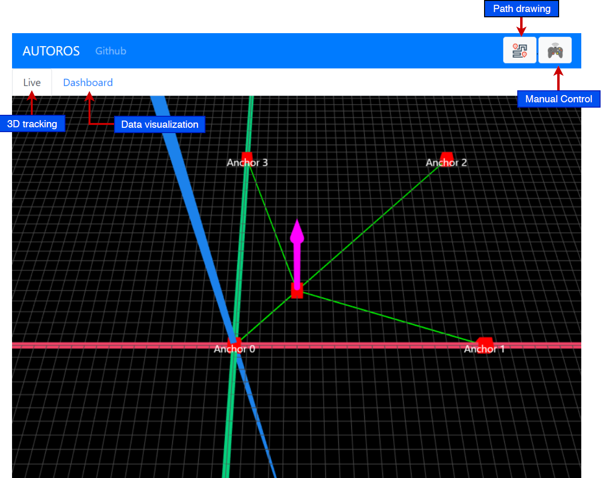

<aside class="notice">
Finished. Currently extended by another team in a thesis project.
</aside>

# autoROS

UU project for autonomous robot using EKF for positioning and PID for controlling. The car can be controlled trought a web App built on React.




# Components are:

- RC car Monster Truck “Cyclone” 4WD RtR (https://www.amazon.de/MONSTERTRUCK-Cyclone-4WD-100-RTR/dp/B07F1355XY)
- DWM10001 module (https://www.decawave.com/product/dwm1001-development-board/) used for real time positioning of the RC car.
- Adafruit 9DOF IMU sensor (https://www.adafruit.com/product/1714) build on:
  - L3GD20H 3-axis gyroscope: ±250, ±500, or ±2000 degree-per-second scale
  - LSM303 3-axis compass: ±1.3 to ±8.1 gauss magnetic field scale
  - LSM303 3-axis accelerometer: ±2g/±4g/±8g/±16g selectable scale
- Raspberry Pi model 3B+

# The project is build on the followinf ROS pkg:

| Package               | Description                      | ROS link                                  | Git Link                                             |
| --------------------- | -------------------------------- | ----------------------------------------- | ---------------------------------------------------- |
| Rosbrideg suite       | For websocket server             | http://wiki.ros.org/rosbridge_suite       | https://github.com/RobotWebTools/rosbridge_suite.git |
| localization_dwm1001  | 4 Anchors 1 Tag                  | http://wiki.ros.org/localizer_dwm1001     | https://github.com/20chix/dwm1001_ros.git            |
| adafruit IMU          | Reading 9DOF IMU                 | -                                         | - https://github.com/rolling-robot/adafruit_imu      |
| imu_filter_madgwick   | Orientation estimation using IMU | http://wiki.ros.org/imu_filter_madgwick   | https://github.com/ccny-ros-pkg/imu_tools.git        |
| teleop_twist_keyboard | Controll robot w/ keyboard       | http://wiki.ros.org/teleop_twist_keyboard | https://github.com/ros-teleop/teleop_twist_keyboard  |

# How to setup the system

To run the server you need to install ROS in your computer or in the raspberry pi. The latest ROS version is `melodic`. The installation insructions are found [here](http://wiki.ros.org/melodic/Installation/Ubuntu). ROS in available for windows but I suggest to work on Ubuntu.

## STEP 1: Create the catkin enviroment

Before starting you need to have a catkin workspace. I suggest to install the `catkin tools` library. ([link here](https://catkin-tools.readthedocs.io/en/latest/index.html)). In you have the `pip` package installer, just run

```
pip install catkin_tools
```

A catkin workspace has the folling structure

```
catkin_ws
├── build
├── devel
├── src
    └── packaga1
    └── packaga2
    ...
    └── packagaN

```

To create the catkin enviroment you need to create a folder with the following structure

```
catkin_ws
├── src
    └── packaga1
    └── packaga2
    ...
    └── packagaN
```

The `devel` and `build` folders are automatically created by the `catkin tools` when you build the workspace. You need to place all the ROS packages that you are using in the project in the `src` folder. Thus, you need to clone `autoROS` project in the `src` folder.

Go to the directory you want to create the catkin workspace and paste the following code

```
mkdir catkin_ws
cd catkin_ws
mkdir src
cd src
git clone git@github.com:dikioth/autoROS.git
cd ..
catkin build
```

The build command will find all sub packages in `autoROS` and build them. When finished, you will se the `build`and `devel` folders.

> **REMEMBER**: You need to build the workspace every time you add a new package in the project.

Now that the catkin workspace is created you need to source the enviroment. You just need to go the `catkin_ws` folder and type

```
source devel/setup.bash
```

> **REMEMBER**: You need to source you enviroment every time you build the catkin workspace.

If you want to create a new package.
catkin create pkg PKG_NAME --system-deps DEP1 DEP2 .. DEPN

```

where `PKG_NAME` is the name of your catkin package and `DEPX` are the dependecies of your project. A common package needs the library `rospy` if you are programming in `python` and `roscpp` if you are programming in `c++`. In some projects it is common to develop in both languages. In this project, the low level drivers such as the `I2C` communication to the `IMU` is done with help of adafruit's library built on `c++`. The publishing of the data is done in python.

It is also important to include the ROS messages you are intended to use in your project. In the case of the `IMU` messages you need to include the `sensor_msgs` .

# Todo:

- Create script in localization_dwm100 that simulates tag position using perlin noise. This is useful for simulating different filters without the dwm hardware.
- Although I din't experience much problem with the RPI3b+ it would be good to migrate to RPI4 and check it's efficiency.

# Useful tools

- Hyper: A multiplatform terminal that allows multiple frames. Specially usefull during ROS development.
- samba
- catkin_tools:

# Tips:

- Work on ubuntu!
- If you get ERROR: cannot launch node of type [<some-file>.py]: can't locate node [<some-file>.py] in package [<some-pkg>] you probably need to make the file executable by calling chmod +x name_of_file.py
- if you get an '.cfg: Permission denied' error. You need to make the .cfg file executable by calling 'chmood +x name_of_file'
- If you want to connect the the ros server in the RPI from your computer you need to export/set the ROS_MASTER_URI in the terminal as following:

  - WINDOWS: `set ROS_MASTER_URI=http://<your-robot-address>:<your-robot-port>`
  - UBUNTU: `export ROS_MASTER_URI=http://<your-robot-address>:<your-robot-port>`

- Samba user must match the rpi user. In this case the user is 'ubuntu'.
- source in ~/.bashrc

# Interesting sources to explore:

- https://ardupilot.org/rover/index.html
- https://www.ubiquityrobotics.com/
- https://www.donkeycar.com/
- http://robotwebtools.org/
- https://xiangzhuo-ding.github.io/ROS_Projects.html
```
